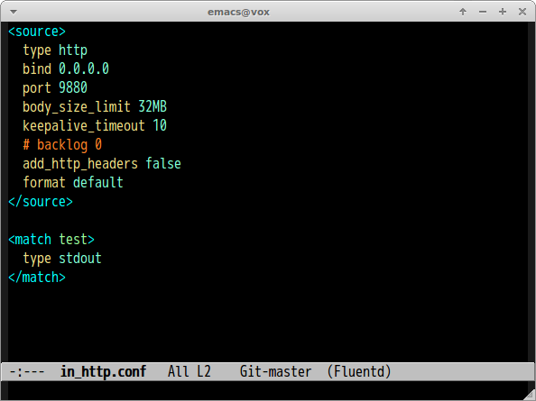

# fluentd-mode.el [![travis badge][travis-badge]][travis-link]

Major mode of [fluentd](http://www.fluentd.org/) configuration file.

## Screenshot

[travis-badge]: https://travis-ci.org/syohex/emacs-fluentd-mode.svg
[travis-link]: https://travis-ci.org/syohex/emacs-fluentd-mode
